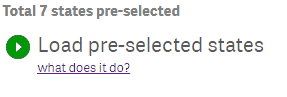
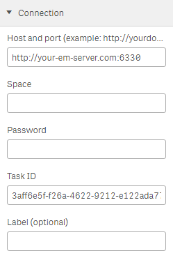

# EasyMorph-Action
Qlik Sense extension for running tasks on EasyMorph Server.

## Installation

Download this repository as a zip archive: https://github.com/easymorph/EasyMorph-Action/archive/master.zip

Qlik Sense Desktop: unzip to a directory under "C:\Users[%Username%]\Documents\Qlik\Sense\Extensions\".

Qlik Sense server: see instructions [how to import an extension on Qlik Sense Server](http://help.qlik.com/en-US/sense/Subsystems/ManagementConsole/Content/import-extensions.htm).

## Configuration

#### Connection section

* **Host and port _[Required]_**: Address and port or your EasyMorph Server.
* **Space**: Name of the spece of the target task. Required for non-default space.
* **Password**: Password for password-protected space.
* **Task ID _[Required]_**: ID of a target task which can be obtained from an URL of the task page on EasyMorph Server (example URL, task Id is marked with bold text: http://<i></i>your-em-server.com:6330/space/default/tasks/edit/**a41004e0-2d5b-4c90-9acc-88a8bd9d756d**).
* **Label**: Text to show instead of a name of the target task when task is idle.

#### Task parameters section

Project parameters to run the target task with. Task will fail in case of incorrectly specified parameter names.

#### App reload section

* **Reloat app when task finishes** - When checked, extension will reload and save current Qlik Sense application after target task will run to completion. Reload of a published task on a Qlik Sense server will result in "Access denied" error. In such case app will be reloaded but will not be saved.
* **Partial reload** - Available only when presious option is checked. Check for parial app reload.

## License

MIT